  <h1>EventQueue ⚡</h1>
  <h3>High-Concurrency Virtual Queue System</h3>

  

    <b>Real-Time • Atomic Operations • Race Condition Free</b>
  

  

    
    
  

---

## 💡 El Problema (The Challenge)

En eventos masivos, la asignación de turnos físicos genera cuellos de botella. Digitalizarlo presenta un desafío técnico crítico: **La Condición de Carrera (Race Condition)**.

> *¿Qué pasa si 100 personas escanean el QR en el mismo milisegundo?*

Si usamos una base de datos tradicional (SQL) para leer el último turno y sumarle 1 (`SELECT max(id) + 1`), múltiples usuarios recibirían el **mismo número de turno** o la base de datos se bloquearía por el exceso de transacciones simultáneas.

## 🚀 La Solución

**EventQueue** implementa una arquitectura híbrida que prioriza la memoria sobre el disco para la asignación de turnos, garantizando unicidad y velocidad.

### ✨ Features Clave
* **Zero Race Conditions:** Uso de operaciones atómicas (`INCR`) en **Redis** para asignar turnos en nanosegundos.
* **Real-Time Feedback:** Comunicación bidireccional vía **Socket.IO**; el usuario ve su posición avanzar en vivo sin recargar la página.
* **Persistencia Asíncrona:** Los datos se vuelcan a **PostgreSQL** mediante **Prisma ORM** para asegurar el registro histórico sin frenar la cola.

---

## 🏗️ Flujo de Concurrencia

Este diagrama ilustra cómo el sistema maneja una petición de turno bajo alta carga:

```mermaid
sequenceDiagram
    participant User as 📱 Usuario (Móvil)
    participant API as 🚀 Node.js API
    participant Redis as ⚡ Redis (Cache)
    participant DB as 🐘 PostgreSQL
    participant Socket as 🔌 Socket.IO

    User->>API: Escanea QR (Solicita Turno)
    
    rect rgb(20, 20, 20)
        note right of API: ⚡ Zona Crítica (Atomicidad)
        API->>Redis: INCR event_queue_counter
        Redis-->>API: Retorna Nuevo Turno (ej: #42)
    end
    
    API-->>User: Confirma Turno #42 (HTTP 200)
    
    par Procesamiento en 2do Plano
        API->>DB: Persistir Turno (Prisma Create)
        API->>Socket: Emitir "QueueUpdated" a todos
    end

    Socket-->>User: Actualizar UI en Tiempo Real

```

## 🛠️ Stack Tecnológico

 
    
  
     
   

